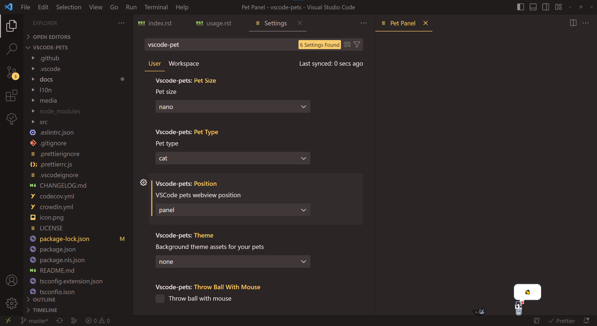

# Getting Started with VS Code Pets

Congrats on installing joy! Enjoy interacting with these cute pixelated pets.
Read below to get a full understanding of this extension.
Not convinced? Watch our extension spotlight on [Visual Studio Code](https://www.youtube.com/watch?v=aE6Ifj_KstI).

## Start pet coding session to show your pet

Open the command palette with `Ctrl+Shift+P` on Windows/Linux or `Cmd(⌘)+Shift+P` on MacOS.  

Run the "Start pet coding session" command (`vscode-pets.start`)

Once you have the pet panel open, you can:

* [Changing your pet](#changing-your-pet)
* [Place the pet's window](#place-the-pets-window)
* [Playing with pets](pets.md#playing-with-pets)
* [Adding additional pets](pets.md#adding-additional-pets)
* [Throwing a ball](pets.md#throwing-a-ball)
* [Roll-call with your pets](pets.md#roll-call-with-your-pets)
* [Removing a single pet or multiple pets](pets.md#removing-a-single-pet-or-multiple-pets)
* [Importing or Exporting your Pet List](pets.md#importing-or-exporting-your-pet-list)
* [Change the background with themes](themes.md)

## Changing your pet

Open the setting panel with `Ctrl+,` on Windows/Linux or `Cmd(⌘)+,` on MacOS. In the search bar, enter “vscode-pets” to see all available options.

Set a default color, size, pet type, position, and theme when you open a Pet Panel.

* Pet Color: black, brown, green, yellow, gray, purple, red, white, orange
* Pet Size: nano, small, medium, large
* Pet Type: cat, chicken, crab, clippy, cockatiel, dog, horse, mod, rocky, rubber duck, snake, totoro, turtle, zappy

### Restrictions

* Snake can only be green
* Rubber duck & Zappy can only be yellow
* Ferris the crab can only be red
* Rocky can only be gray
* Mod can only be purple

## Place the pet's window

To switch the pet's window between *explorer (default)* and *panel*, you can use the command `vscode-pets.position`.
Or in the setting panel the option `Position`.

**Explorer**:

**Panel**:

