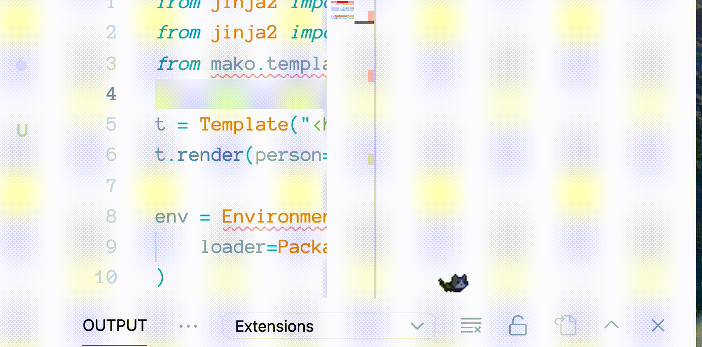
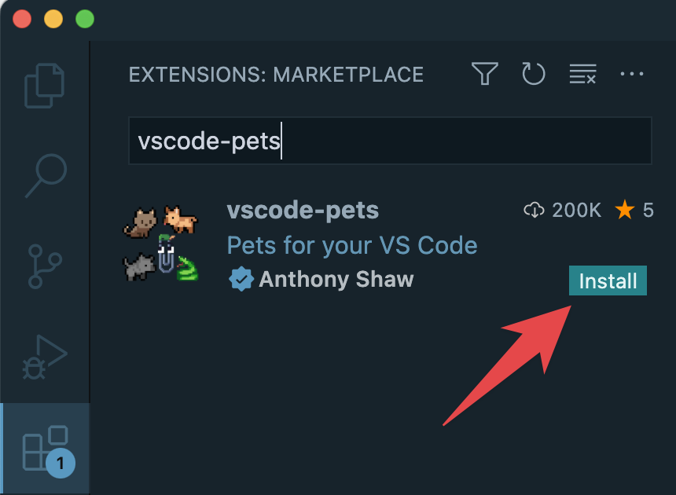
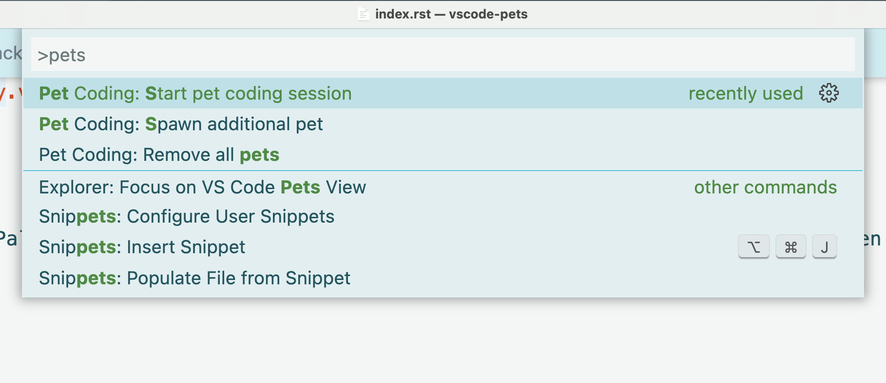
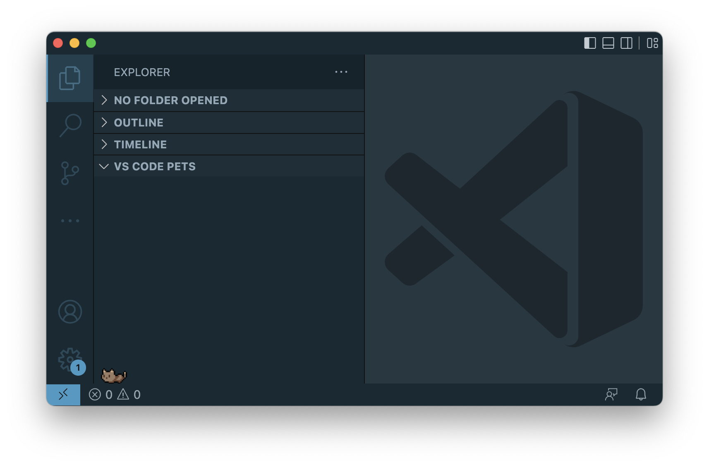

# VS Code Pets

An extension for VS Code that puts pets in your editor to keep you company whilst you code.

[Visual Studio Marketplace](https://marketplace.visualstudio.com/items?itemName=tonybaloney.vscode-pets&WT.mc_id=python-17801-anthonyshaw)

## Installation

### From the VS Code Marketplace

Install this extension from the [VS Code marketplace](https://marketplace.visualstudio.com/items?itemName=tonybaloney.vscode-pets&WT.mc_id=python-17801-anthonyshaw).

### From VS Code

With VS Code open, search for `vscode-pets` in the extension panel (`Ctrl+Shift+X` on Windows/Linux or `Cmd(⌘)+Shift+X` on MacOS) and click install.

Alternatively, with VS Code open, launch VS Code Quick Open (`Ctrl+P` on Windows/Linux or `Cmd(⌘)+P` on MacOS), paste the following command, and press enter.

`ext install tonybaloney.vscode-pets`

## Getting Started

Launch VS Code Command Palette (`Ctrl+Shift+P` on Windows/Linux or `Cmd(⌘)+Shift+P` on MacOS, then type `pets` and select `Pets: Start Pet Coding Session`.

This will open a new sub-panel inside the `Explorer` panel:

From here, you can add multiple pets, give them names, change the background. Find out how in the [usage section](usage.md).

## Thank you

Thanks to all the [contributors](https://github.com/tonybaloney/vscode-pets/graphs/contributors) to this project.
