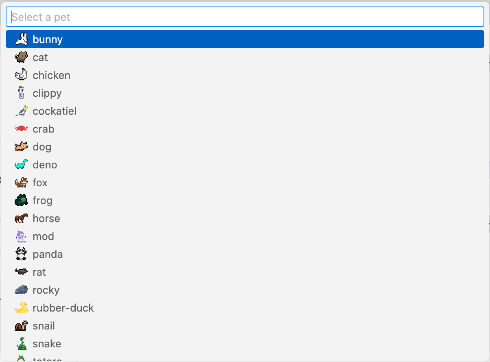

# Pets

## Playing with pets

Pets will interact with your mouse pointer within the open Pet Panel. Additionally, pets will display text bubbles as you move your mouse over the pet.

## Adding additional pets

To add additional pets, run the "Spawn pet" command (`vscode-pets.spawn-pet`) or click the `+` icon.

Once you've done this, select the pet type, color, and then choose a name or use the randomly assigned one.

If you have more than 1 pet, they become friends. When pets become friends, they will say a little "❤️" and then play chase with each other.

You can also click the squirrel icon in the bottom of the VS Code Window to create pets.

## Throwing a ball

Play catch with your pet! Click the ball icon in the VS Code Pets panel to throw the ball:

You can also use the "Throw ball" command (`vscode-pets.throw-ball`).

-   Rocky will not run & catch a ball. Have you ever seen a rock run after a ball? Neither have we.

Want to challenge your pets to a harder game of fetch? Enable the "Throw ball with mouse" (`vscode-pets.throwBallWithMouse`) option in the settings.
Then use the mouse to click and throw the ball:

## Roll-call with your pets

Get a description of your current pets within VS Code. Run the "Roll-call" command (`vscode-pets.roll-call`) from the command palette.

## Removing a single pet or multiple pets

You can remove all pets (except the 1 configured) by running the "Remove all pets" command (`vscode-pets.delete-pets`) from the command palette.

You can remove specific pets by clicking the trashcan icon or by running the "Remove pet" command (`vscode-pets.delete-pet`) from the command palette.

## Importing or Exporting your Pet List

Have a certain pet setup you would like to share with your friends?
You can export your pet list by running the "Export pet list" command (`vscode-pets.export-pets`) from the command palette.
The pet list can be imported by running the "Import pet list" command (`vscode-pets.import-pets`) from the command palette.

## Pet Gallery

|       Bunny      |               Cat             |    Chicken  |   Clippy |   Cockatiel |
| :--------------------------------------------------: | :-----------------------------------------------------------: | :-------------------------------------------------: | :--------------------------------------------: | :-----------------------------------------------------: |
|         Crab       |             Deno            |          Dog        |       Fox      |          Frog         |
|       Horse      |               Mod             |       Morph     |    Panda   |            Rat          |
|       Rocky      |   Rubber Duck |   Skeleton |    Snail   |         Snake       |
|   Squirrel |          Totoro         |     Turtle    |    Zappy   |                                                         |
