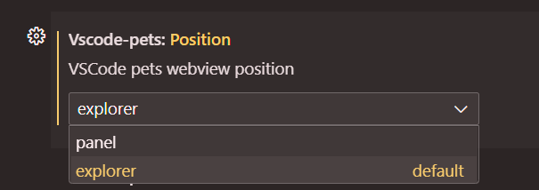
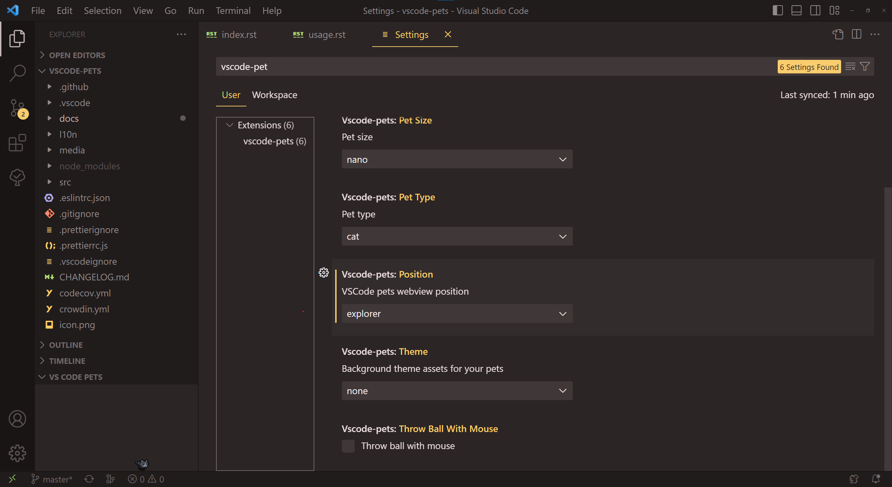
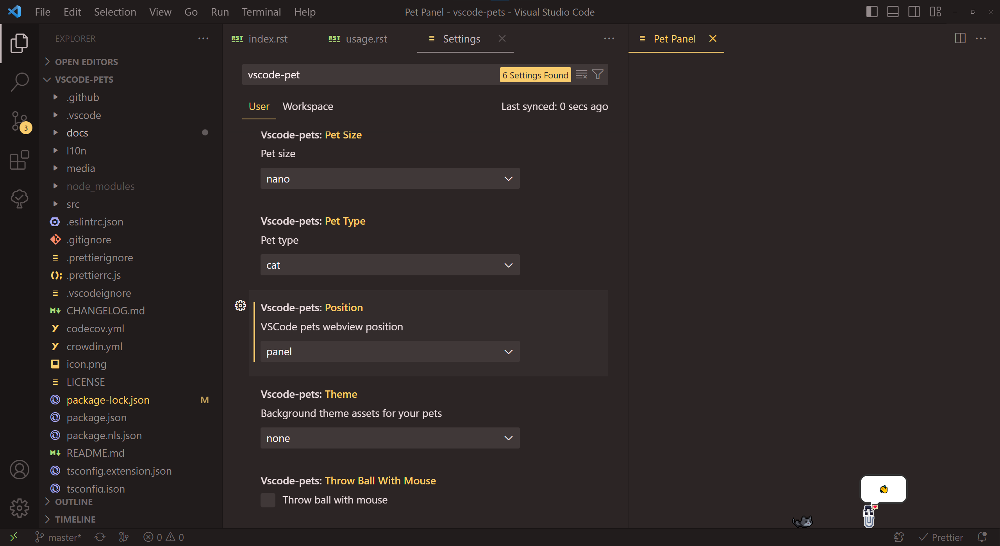
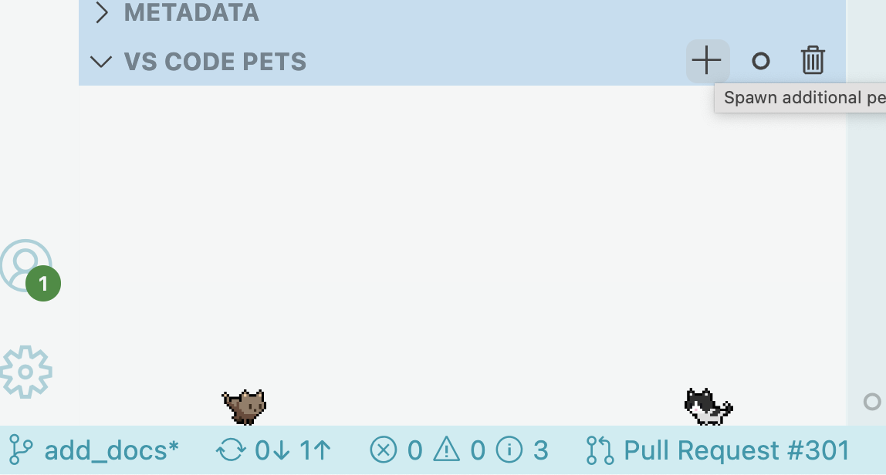
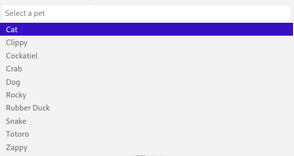
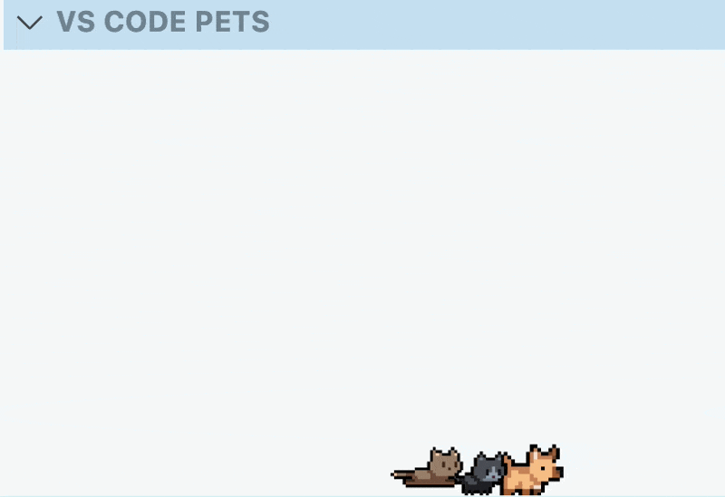
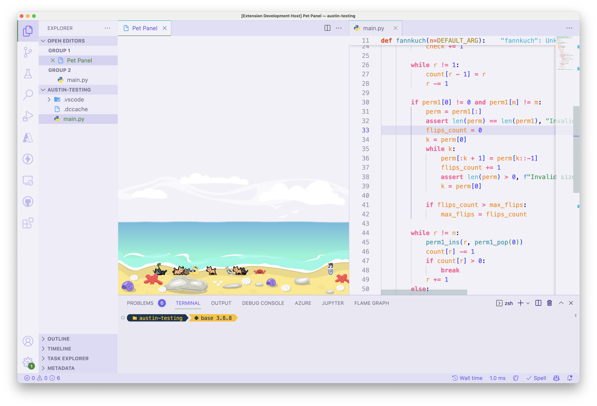

Using VS Code Pets
==================

Congrats on installing joy! Enjoy interacting with these cute pixelated pets. 
Read below to get a full understanding of this extension. 
Not convinced? Watch our extension spotlight on `Visual Studio Code <https://www.youtube.com/watch?v=aE6Ifj_KstI>`_.

Start pet coding session to show your pet
-----------------------------------------

Open the command palette with `Ctrl+Shift+P` on Windows/Linux or `Cmd(⌘)+Shift+P` on MacOS.  

Run the "Start pet coding session" command (`vscode-pets.start`)

Once you have the pet panel open, you can:

* :ref:`Changing your pet`
* :ref:`Place the pet's window`
* :ref:`Playing with pets`
* :ref:`Adding additional pets`
* :ref:`Throwing a ball`
* :ref:`Roll-call with your pets`
* :ref:`Removing a single pet or multiple pets`
* :ref:`Themes`

Changing your pet
-----------------

Open the setting panel with `Ctrl+,` on Windows/Linux or `Cmd(⌘)+,` on MacOS. In the search bar, enter “vscode-pets” to see all available options.

Set a default color, size, pet type, position, and theme when you open a Pet Panel.

* Pet Color: black, brown, green, yellow, gray, purple, red, white
* Pet Size: nano, small, medium, large
* Pet Type: cat, chicken, crab, clippy, cockatiel, dog, mod, rocky, rubber duck, snake, totoro, zappy

.. image:: _static/screenshot-2.gif
   :alt: Usage screenshot

Restrictions
++++++++++++

* Snake can only be green
* Rubber duck & Zappy can only be yellow
* Ferris the crab can only be red
* Rocky can only be gray
* Mod can only be purple

Place the pet's window
----------------------

To switch the pet's window between *explorer (default)* and *panel*, you can use the command `vscode-pets.position`.
Or in the setting panel the option `Position`.

**Explorer**:

**Panel**:

Playing with pets
-----------------

Pets will interact with your mouse pointer within the open Pet Panel. Additionally, pets will display text bubbles as you move your mouse over the pet.

.. image:: _static/screenshot-3.gif

Adding additional pets
----------------------

To add additional pets, run the "Spawn additional pet" command (`vscode-pets.spawn-pet`) or click the `+` icon.

Once you've done this, select the pet type, color, and then choose a name or use the randomly assigned one.

If you have more than 1 pet, they become friends. When pets become friends, they will say a little "❤️" and then play chase with each other.

You can also click the squirrel icon in the bottom of the VS Code Window to create pets.

Throwing a ball
---------------

Play catch with your pet! Click the ball icon in the VS Code Pets panel to throw the ball:

.. image:: _static/throw-ball.gif

You can also use the "Throw ball" command (`vscode-pets.throw-ball`).

* Rocky will not run & catch a ball. Have you ever seen a rock run after a ball? Neither have we.

Want to challenge your pets to a harder game of fetch? Enable the "Throw ball with mouse" (`vscode-pets.throwBallWithMouse`) option in the settings. 
Then use the mouse to click and throw the ball:

Roll-call with your pets
------------------------

Get a description of your current pets within VS Code. Run the "Roll-call" command (`vscode-pets.roll-call`) from the command palette.

.. image:: _static/pet-roll-call.png

Removing a single pet or multiple pets
--------------------------------------

You can remove all pets (except the 1 configured) by running the "Remove all pets" command (`vscode-pets.delete-pets`) from the command palette.

You can remove specific pets by clicking the trashcan icon or by running the "Remove pet" command (`vscode-pets.delete-pet`) from the command palette.

.. image:: _static/pet-remove.png

Themes
------

VS Code Pets comes with themes. Themes are set from the VS Code Preferences Window. Search for "vscode-pets" to find the VS Code Pets specific settings.

Configure `vscode-pets.theme` to `"forest"` and let your pets play in a spooky forest.

.. image:: _static/forest.gif

Set `vscode-pets.theme` to `"castle"` for them to roam the ramparts!

.. image:: _static/castle.gif

Set `vscode-pets.theme` to `"beach"` for your friends to play by the ocean.

